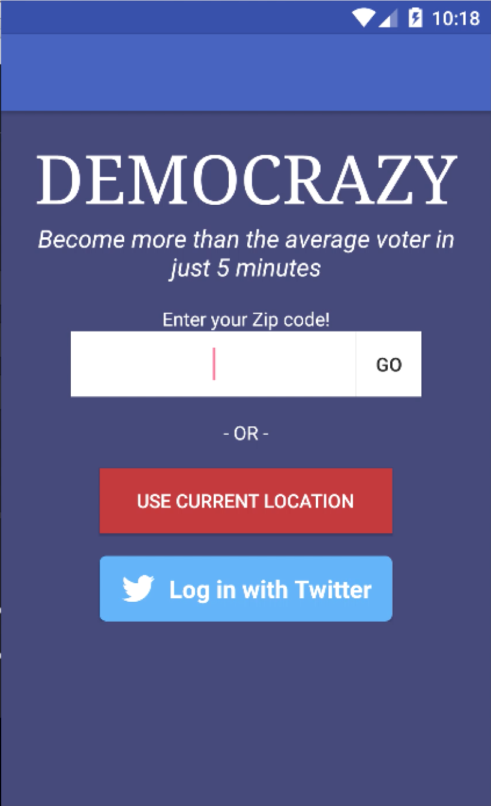
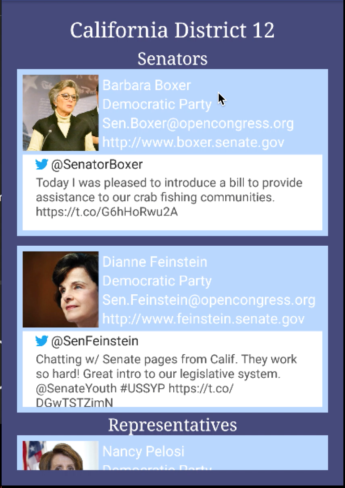
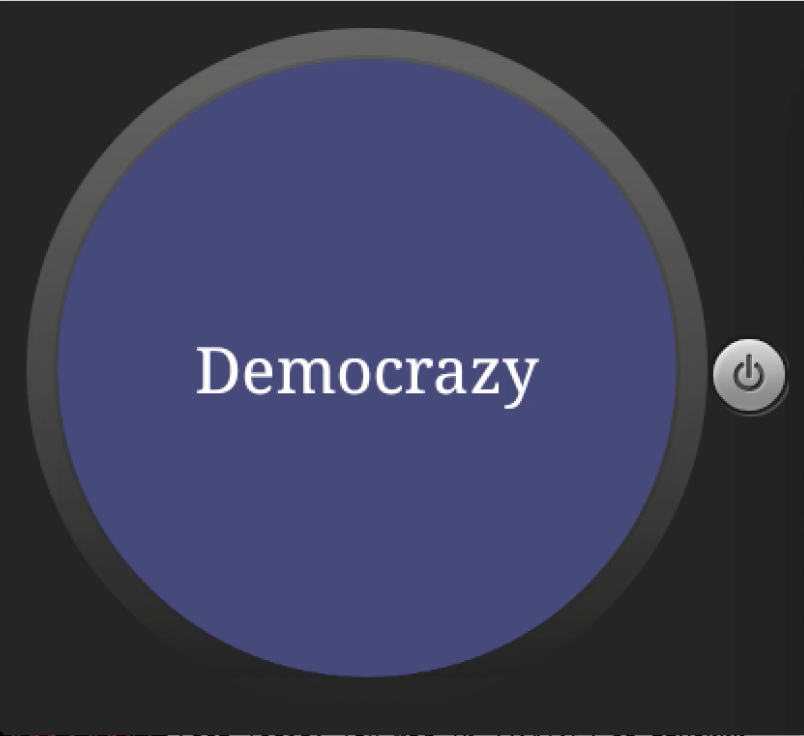
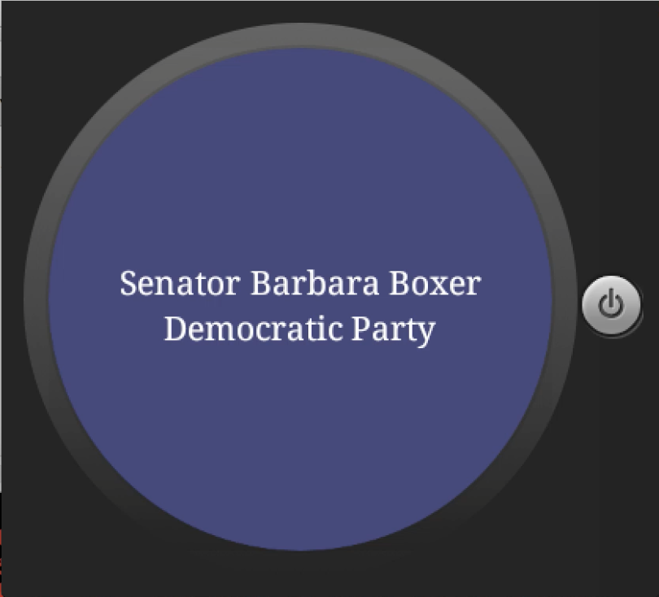
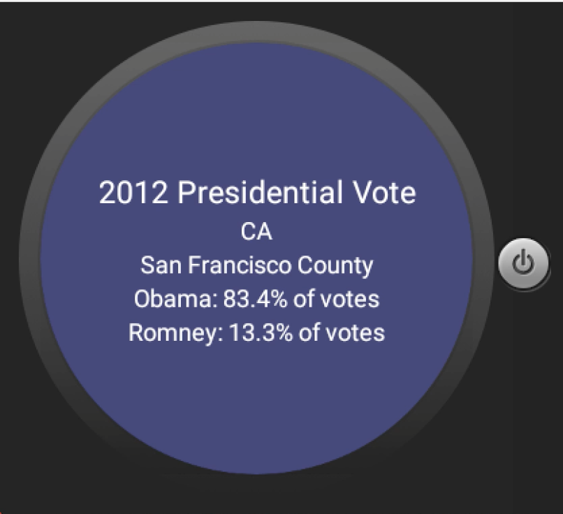

# PROG 02: Represent!

Ever wished you actually knew more about politics? Decided you're finally done with being a single issue voter? Ever wonder if your representatives actually vote on bills that you support? Then this is the app for you!

## Authors

Anthony Lai ([a.lai@berkeley.edu](mailto:a.lai@berkeley.edu))

## Demo Video

Watch the [keynote](https://www.youtube.com/watch?v=apmEwE245gw)!

## Screenshots

## Acknowledgments

 * Shoutout to android docs for providing like 50% of the code that actually makes things runs behind the scenes.
 * Also shoutout to catnip for the phone / watch communication
 * Most of the ugly code was copy/pasted from forums about the APIs or google docs.